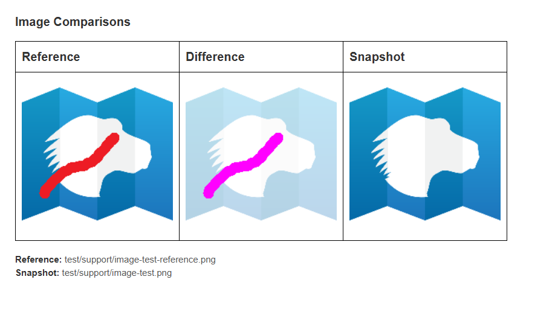

# Approval

Support for approval testing, especially of code that generated image.

First, the test wouldn't be manually reviewed:

    import Approve

    test "example test" do
      snapshot = File.write!("snapshot.png", create_new_image_data(...))

      approve snapshot: File.read!("snapshot.png"),
              reference: File.read!("reference.png"), # this file doesn't exist, it will be created
              reviewed: false # the user hasn't manually reviewed the reference yet
    end

When you run the test above, the code will copy the snapshot into the reference.
This creates the new `"reference.png"` file, which you must review manually.
Further snapshots will be compared to this reference.
Until you review the reference file, the test will fail.
After reviewing the reference file, you should update the code above by replacing
`reviewed: false` by `reviewed: true`, so that it reads:

    import Approve

    test "example test" do
      snapshot = File.write!("snapshot.png", create_new_image_data(...))

      approve snapshot: File.read!("snapshot.png"),
              reference: File.read!("reference.png"), # this file exists and has been reviewed
              reviewed: true # the user has reviewed the reference
    end

If at any point the snapshot file becomes different from the reference,
the test will fail and the `approve` macro will generate an HTML file
next to the snapshot named "snapshot.png.diff.html" (in general it will be
`reference_path <> "diff.html"`). That HTML file contains the old and new
versions of the images side by side. In the middle it shows the difference
between the two images.

If at any point you want to change the reference file (let's say you have
found a bug in the code that generated the previous reference), you can
simply add a new reference file manually.

This is an example `diff.html` file made from two images:



### Implementation notes

The most portable way of comparing two images is by running javascript
inside a web browser, which is what we do here.
One possible criticism is that the user needs to manually open the HTML
files in a web browser to view the results, instead of having the test suite
spin up a web app which would centralize all images and even allow one to
approve changes from the web browser itself.

However, that implementation is not very portable and is quite complex.
This implementation is optimized for simplicity, and it has settled on using
the filesystem as the only source of persistence.
The downside is the whole manual fiddling with files, but that is not too bad
in practice

In the future, I plan to support other kinds of data besides images,
and that is the goal of the somewhat verbose `snapshot: File.read!(path)`
syntax, instead of the shorter `snapshot: path` alternative.

## Installation

The package is [available in Hex](https://hex.pm/docs/publish) and can be installed
by adding `approval` to your list of dependencies in `mix.exs`:

```elixir
def deps do
  [
    {:approval, "~> 0.1.0"}
  ]
end
```

The docs can be found at <https://hexdocs.pm/approval>.

